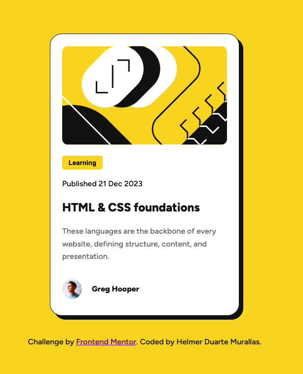

# Frontend Mentor - Blog preview card solution

This is a solution to the [Blog preview card challenge on Frontend Mentor](https://www.frontendmentor.io/challenges/blog-preview-card-ckPaj01IcS). Frontend Mentor challenges help you improve your coding skills by building realistic projects. 

## Table of contents

- [Overview](#overview)
  - [The challenge](#the-challenge)
  - [Screenshot](#screenshot)
  - [Links](#links)
- [My process](#my-process)
  - [Built with](#built-with)
  - [What I learned](#what-i-learned)
  - [Continued development](#continued-development)
  - [AI Collaboration](#ai-collaboration)
- [Author](#author)
- [Acknowledgments](#acknowledgments)

## Overview

### The challenge

Users should be able to:

- See hover and focus states for all interactive elements on the page
- View the optimal layout depending on their device's screen size

### Screenshot

### Links

- Solution URL: https://github.com/helmer12/blog-preview-card.git
- Live Site URL: https://helmer12.github.io/blog-preview-card/

## My process

### Built with

- Semantic HTML5 markup
- CSS custom properties
- Flexbox
- CSS Grid
- Mobile-first workflow
- Responsive design principles

### What I learned

During this project, I improved my understanding of:
- Semantic HTML structure using <main>, <article>, and <section>
- Styling hover states
- Using box-shadow to create depth in UI design

One piece of CSS I better understood was: box-shadow: 8px 8px 0 var(--Gray-950);

This helped me learn how horizontal offset, vertical offset, blur radius, and color work together to create shadows.

I also learned the importance of using classes instead of IDs for styling. At first, I used IDs for elements such as images, but later I refactored the code to use classes. This helped me understand that classes are reusable and more flexible, while IDs are more specific and better suited for unique elements or JavaScript interactions.

### Continued development

In future projects, I want to continue improving:

- Responsive design techniques
- CSS layout skills
- Accessibility practices
- Component organization
- Hover and focus interactions
- Mobile-first development workflow

### AI Collaboration

I used ChatGPT as a learning assistant during this project. The most useful part was receiving explanations instead of simply copying solutions, which helped me understand the reasoning behind the code.

## Author

- Frontend Mentor - @helmer12
- GitHub - @helmer12

## Acknowledgments

Thanks to Frontend Mentor for providing beginner-friendly projects that help developers practice real-world frontend skills.